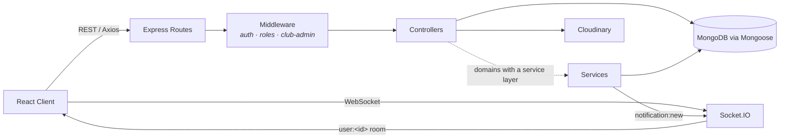

<div align="center">

# 🎓 CampusOS

**One platform for academics, clubs, events, discussions, and placements.**

A full-stack MERN application that centralizes everything a college student
needs — classroom logistics, campus community, and career/placement
management — behind a single login.

[](https://react.dev/)
[](https://expressjs.com/)
[](https://mongoosejs.com/)
[](https://socket.io/)
[](https://tailwindcss.com/)
[](#license)

</div>

---

## Table of Contents

- [Overview](#overview)
- [Feature Highlights](#feature-highlights)
- [Tech Stack](#tech-stack)
- [Architecture](#architecture)
- [Project Structure](#project-structure)
- [Getting Started](#getting-started)
- [Environment Variables](#environment-variables)
- [Roles & Permissions](#roles--permissions)
- [API Surface](#api-surface)
- [Roadmap](#roadmap)
- [Contributing](#contributing)
- [License](#license)
- [Author](#author)

---

## Overview

CampusOS replaces the usual scatter of WhatsApp groups, notice boards, and
spreadsheets with one coherent system. Students get a single dashboard for
class deadlines, club activity, and placement drives; class representatives,
club admins, and placement coordinators get purpose-built tools to manage
their part of campus life; and everything is tied together by a unified
notice and real-time notification layer.

The repository is a monorepo of two independent apps:

| App | Path | Stack |
|---|---|---|
| **API** | [`backend/`](backend) | Express, Mongoose/MongoDB, Socket.IO |
| **Client** | [`frontend/`](frontend) | React 18, Vite, Tailwind CSS |

---

## Feature Highlights

### 🔐 Authentication & Authorization
- Cookie-based JWT auth — short-lived **access token** + rotating **refresh token**, both `httpOnly`
- Password hashing with bcrypt
- Role-based access control (`student`, `placementCoordinator`, `superadmin`)
- Contextual, resource-scoped permissions layered on top of roles — **club admins** (per club), **event organizers** (per event), and a **class representative** (per classroom)
- Protected frontend routes with automatic session hydration

### 🏠 Personalized Dashboard
- One glance summary of what matters *today*
- Upcoming deadlines, events, and placement drives
- Latest notices scoped to the signed-in user
- Parallelized, `.lean()` aggregate queries for fast loads

### 📚 Classroom & Curriculum
- Section-based classrooms (branch + batch + section) with a weekly period timetable
- Curriculum & subject management per semester
- Study resources tied to subjects
- Deadline tracking for assignments/submissions
- Class representative designation per classroom
- Competitive-exam preparation resource hub

### 🧑‍🤝‍🧑 Community
- **Clubs** — discovery, follow/unfollow, mute, per-club admin management, logo/banner branding
- **Events** — creation, registration, organizer management, event-scoped notices
- **Discussions** — threaded discussions with comments and replies, soft-deletion, moderation queue for admins

### 💼 Placement Portal
- Placement drive listings with company, role, CTC/stipend, and eligibility criteria (branch, CGPA, year, backlog limits)
- Automatic eligibility checks against a student's academic profile
- One-click applications with resume attachment and a unique per-student-per-drive constraint
- **Multi-round recruitment pipeline** — coordinators define an ordered sequence of rounds, advance the active cohort round by round, and shortlist/reject/select candidates at each stage
- Full application timeline per candidate (status changes, notes, who changed what, when)
- Placement coordinator dashboard for managing drives end-to-end

### 🔔 Notice & Notification System
- A single polymorphic **Notice** model drives platform, classroom, club, event, and placement notices — one feed component, every context
- Priority levels, expiry dates, and rich metadata per notice
- **Real-time notifications** over Socket.IO — authenticated per-user rooms, `notification:new` push events, persisted in MongoDB so nothing is missed while offline

### 🔎 Global Search
- Cross-domain search across clubs, events, drives, and discussions from one search bar

### 🖼️ File Uploads
- Cloudinary-backed image pipeline via a generic upload endpoint
- Local temp storage (Multer) with guaranteed cleanup on success or failure
- Powers profile pictures, club logos/banners, and event posters

### 🛠️ Admin Panel
- Manage clubs, placement drives, classrooms, and curricula
- Discussion moderation queue
- Platform-wide notice authoring

---

## Tech Stack

<table>
<tr>
<td valign="top" width="50%">

**Frontend**
- React 18 + Vite
- React Router 6
- Tailwind CSS 4
- Axios (with auto refresh-token retry interceptor)
- Context API for auth & notification state
- Socket.IO client
- lucide-react / react-icons

</td>
<td valign="top" width="50%">

**Backend**
- Node.js + Express
- MongoDB + Mongoose
- Socket.IO (real-time notifications)
- Redis client (caching layer, in progress)
- JSON Web Tokens (access + refresh)
- Multer + Cloudinary (media pipeline)
- bcryptjs (password hashing)

</td>
</tr>
</table>

---

## Architecture

The backend follows a layered request pipeline, with cross-cutting concerns
(auth, RBAC, error handling, async error propagation) implemented as
reusable middleware rather than duplicated per-route.



> Not every domain has a service layer — auth, dashboard/search, drive
> eligibility & shortlisting, and notifications go through `services/`;
> most CRUD controllers (events, clubs, notices, announcements,
> discussions, classroom) query models directly.

---

## Project Structure

```text
CampusOS
├── backend
│   ├── config          # DB (MongoDB) and Redis client setup
│   ├── constants        # Shared enums (event categories, resource categories)
│   ├── controllers      # Request handling + most domain logic
│   ├── middleware       # auth, roles, club-admin guards, error/async handling
│   ├── models            # Mongoose schemas (User, Club, Event, Drive, Notice, …)
│   ├── routes           # Route definitions per resource
│   ├── scripts           # One-off maintenance/migration scripts
│   ├── services         # auth, dashboard/search, eligibility, shortlisting, notifications
│   ├── sockets           # Socket.IO auth + connection handling
│   ├── utils              # ApiError, asyncHandler, sendResponse, cloudinary, cache
│   └── server.js
│
├── frontend
│   ├── src
│   │   ├── api            # One thin wrapper per backend resource, built on axios.js
│   │   ├── components     # cards, common, forms, layout
│   │   ├── constants       # Roles, branches, categories, years
│   │   ├── context         # AuthContext, NotificationContext
│   │   ├── hooks           # useAuth, useSocket, …
│   │   └── pages           # Route groups: dashboard, academics, community, career, admin…
│   └── vite.config.js
│
└── README.md
```

---

## Getting Started

### Prerequisites
- Node.js 18+
- A MongoDB connection string (local or Atlas)
- A Cloudinary account (for image uploads)
- (Optional) A Redis instance — the app runs fine without one

### Clone

```bash
git clone https://github.com/aravindpulkam3/CampusOS.git
cd CampusOS
```

### Backend

```bash
cd backend
npm install
```

Create `backend/.env` (see [Environment Variables](#environment-variables) below), then:

```bash
npm run dev     # nodemon server.js
# or
npm start       # node server.js
```

### Frontend

```bash
cd frontend
npm install
npm run dev     # Vite dev server, proxies /api/* to localhost:5000
```

Both servers need to be running concurrently — there is no root-level script
that starts both for you.

---

## Environment Variables

### `backend/.env`

| Variable | Description |
|---|---|
| `PORT` | Port the Express/Socket.IO server listens on (default `5000`) |
| `MONGO_URI` | MongoDB connection string |
| `CLIENT_URL` | Frontend origin, used for CORS (HTTP + Socket.IO) |
| `JWT_ACCESS_SECRET` / `JWT_ACCESS_EXPIRY` | Access token signing secret & TTL (e.g. `15m`) |
| `JWT_REFRESH_SECRET` / `JWT_REFRESH_EXPIRY` | Refresh token signing secret & TTL (e.g. `7d`) |
| `CLOUDINARY_CLOUD_NAME` | Cloudinary cloud name |
| `CLOUDINARY_API_KEY` | Cloudinary API key |
| `CLOUDINARY_API_SECRET` | Cloudinary API secret |
| `REDIS_URL` | Redis connection string (optional — failures are caught and logged, not fatal) |
| `NODE_ENV` | `production` enables the `secure` flag on auth cookies |

### `frontend/.env`

| Variable | Description |
|---|---|
| `VITE_API_URL` | Backend API base URL (optional, defaults to `http://localhost:5000/api`) |

---

## Roles & Permissions

| Role | Scope |
|---|---|
| `student` | Default role — dashboard, classroom, community, and placement access |
| `placementCoordinator` | Manages placement drives, applications, and shortlisting |
| `superadmin` | Full platform administration |

On top of these global roles, three **contextual** permissions apply per
resource rather than per user:

| Relationship | Grants |
|---|---|
| Club `clubAdmins` | Manage a specific club's profile, roster, and announcements |
| Event `eventOrganizers` | Manage a specific event and post event notices |
| Classroom `classRepresentative` | Represent a specific classroom (one student per classroom) |

---

## API Surface

All routes are mounted under `/api` and return a consistent envelope —
`{ success, message, data }`.

| Base path | Responsibility |
|---|---|
| `/api/auth` | Signup, login, logout, token refresh, current user |
| `/api/dashboard` | Aggregated dashboard + global search |
| `/api/clubs` | Club CRUD, follow/mute, admin management |
| `/api/events` | Event CRUD, registration, organizers |
| `/api/classroom`, `/api/admin/classroom` | Timetables, deadlines, resources |
| `/api/curriculum` | Curriculum & subject management |
| `/api/discussions` | Discussions, comments, replies, moderation |
| `/api/notices` | Polymorphic notices across all contexts |
| `/api/announcements` | Club/event announcements |
| `/api/drives`, `/api/applications` | Placement drives, applications, rounds, shortlisting |
| `/api/notifications` | Persisted notifications, read/unread state |
| `/api/v1/upload` | Generic Cloudinary image upload |

---

## Roadmap

- [x] Real-time notifications over Socket.IO
- [x] Cross-domain global search
- [ ] Active Redis caching for hot read paths
- [ ] Background job queue (BullMQ)
- [ ] AI-assisted resume analysis
- [ ] Drive/event recommendation engine
- [ ] Browser push notifications
- [ ] Docker Compose setup for one-command local dev

---

## Contributing

Contributions, issues, and feature suggestions are welcome. Fork the repo,
create a feature branch, and open a pull request.

---

## License

Licensed under the [MIT License](LICENSE).

---

## Author

**Aravind Pulkam**
GitHub: [@aravindpulkam3](https://github.com/aravindpulkam3)
