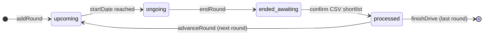
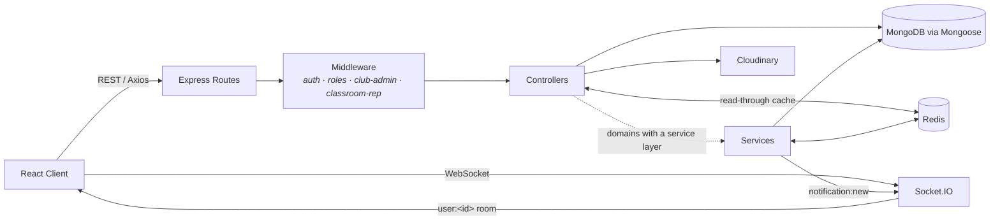

<div align="center">

# 🎓 CampusOS

**One platform for academics, clubs, events, discussions, and placements.**

A full-stack MERN application that centralizes everything a college student
needs — classroom logistics, campus community, and the entire placement
pipeline — behind a single login, with a dashboard that answers one
question: _what needs my attention today?_

[](https://react.dev/)
[](https://expressjs.com/)
[](https://mongoosejs.com/)
[](https://redis.io/)
[](https://socket.io/)
[](https://tailwindcss.com/)
[](#license)

</div>

---

## Table of Contents

- [Overview](#overview)
- [Feature Highlights](#feature-highlights)
- [Engineering Highlights](#engineering-highlights)
- [Tech Stack](#tech-stack)
- [Architecture](#architecture)
- [Project Structure](#project-structure)
- [Getting Started](#getting-started)
- [Environment Variables](#environment-variables)
- [Roles & Permissions](#roles--permissions)
- [API Surface](#api-surface)
- [Roadmap](#roadmap)
- [Contributing](#contributing)
- [License](#license)
- [Author](#author)

---

## Overview

CampusOS replaces the usual scatter of WhatsApp groups, notice boards, and
spreadsheets with one coherent system:

- **Students** get a personalized dashboard that merges today's classes,
  registered events, and placement rounds into one timeline, and surfaces
  anything due today or tomorrow.
- **Class representatives** run their section's timetable, deadlines, and
  semester progression.
- **Club admins and event organizers** manage their clubs, events,
  announcements, and notices.
- **Placement coordinators** run drives end-to-end — from eligibility-gated
  applications through multi-round CSV shortlisting to final selection.

Everything is tied together by a unified notice system and real-time,
persisted notifications.

The repository is a monorepo of two independent apps:

| App        | Path                    | Stack                                       |
| ---------- | ----------------------- | ------------------------------------------- |
| **API**    | [`backend/`](backend)   | Express, Mongoose/MongoDB, Redis, Socket.IO |
| **Client** | [`frontend/`](frontend) | React 18, Vite, Tailwind CSS 4              |

---

## Feature Highlights

### 🏠 Personalized Student Dashboard

Every section answers _"why should **this** student see this?"_. The server
returns render-ready data, so the frontend never works out business rules
from raw domain objects.

- **Action Required** — registration deadlines for eligible drives you haven't applied to, assignment deadlines, placement rounds, registered events, and urgent notices, all within a today/tomorrow window and ranked `critical` (today) or `warning` (tomorrow)
- **Today's Schedule** — classroom periods, registered events (including multi-day events already in progress), and your placement rounds, merged into one sorted timeline
- **Upcoming Deadlines** — scoped to your classroom's _current_ semester
- **Eligible Drives** — open drives you qualify for and haven't applied to yet
- **Relevant Notices** — from your classroom, followed clubs, registered events, and relevant drives; a notice already shown under Action Required isn't repeated here
- Built from parallel `.lean()` queries (dependent queries run in a few rounds, independent ones in parallel), with a loading skeleton on the frontend

### 📚 Classroom & Curriculum

- Section-based classrooms (`branch + batch + section`, unique) linked to a per-branch, per-semester **curriculum** of subjects
- Weekly **period timetable** (day, subject, faculty, room, time slot), managed by the class representative
- **Deadlines** tied to the semester they were created in; once the classroom moves on to the next semester, they can no longer be edited
- **Semester lifecycle** — the class rep advances to the next semester in one step. The server always works out the next number itself and refuses if no curriculum exists for it; only a superadmin can override the number
- Admin tools to create classrooms, assign class reps, and manage curricula

### 🧑‍🤝‍🧑 Community

- **Clubs** — discovery, popular clubs, follow/unfollow, **mute** (stops a club's notifications without unfollowing), per-club admins, logo/banner branding
- **Events** — creation and editing, registration, organizer management, event-scoped announcements and notices
- **Discussions** — upvotes, bookmarks, threaded comments and replies, **accepted answers**, locking, and soft deletion
- A community announcement feed with "load more" pagination

### 💼 Placement Portal

- Drive listings with company, role, job/drive type, CTC/stipend, bond, and eligibility criteria (branches, batch, CGPA, year range, backlog limit)
- **One eligibility engine** shared by the drive listings, career dashboard, student dashboard, and apply endpoint — a drive shown as eligible is never rejected on apply
- One application per student per drive (enforced by a unique index), with resume attachment
- **Multi-round recruitment pipeline** — coordinators define an ordered list of rounds, then schedule, end, and advance them round by round
- **CSV shortlisting** — upload a `rollNumber` list and get a preview that sorts rows into _valid_, _duplicate_, _unknown roll number_, _never applied_, and _already decided_. Confirming re-checks everything against the live database; students who aren't shortlisted are rejected
- Drive lifecycle: `active → completed | cancelled`, with the final survivors marked `selected` when a drive is finished
- A full per-candidate **timeline** (status changes, notes, which round, who changed it, when)
- Students are notified when they're shortlisted, rejected, or selected, and only see round schedules for rounds they've actually reached



### 🔔 Notices & Real-Time Notifications

- A single polymorphic **Notice** model (`targetType` + `targetId`) serves platform, classroom, club, event, and drive notices — one feed component works everywhere
- Priority levels (`low → urgent`), pinning, archiving, and optional expiry; classroom notices can be limited to the current semester
- Pin, archive, and delete use one shared permission check, so they can't get out of sync
- **Real-time notifications** over Socket.IO — the socket handshake checks the same JWT cookie as HTTP requests, each user gets a private `user:<id>` room, and a `notification:new` event is pushed on every new notification
- Notifications are saved in MongoDB (unread count, mark read / mark all read), so nothing is lost while a user is offline
- Automatic notifications go to club followers (skipping users who muted the club), event registrants, eligible students (new drives), drive applicants, classroom students, and everyone (platform notices)

### 🔎 Global Search

- One search bar across clubs, events, drives, and discussions (debounced on the client, cached on the server)

### 🖼️ File Uploads

- Images are saved to a local temp folder (Multer), uploaded to Cloudinary, and the temp file is always deleted, whether the upload succeeds or fails
- Used for profile pictures, club logos/banners, and event posters
- Shortlist CSVs take a separate path: held in memory only, 2 MB limit, CSV files only, and never uploaded to Cloudinary

### 👤 Profiles

- Academic profile (branch, year, batch, section, roll number, CGPA, backlogs), used for eligibility and classroom membership
- Skills, bio, resume, and GitHub/LinkedIn/portfolio links

---

## Engineering Highlights

Design decisions worth calling out:

| Concern                           | Approach                                                                                                                                                                                                                                                                                                                                      |
| --------------------------------- | --------------------------------------------------------------------------------------------------------------------------------------------------------------------------------------------------------------------------------------------------------------------------------------------------------------------------------------------- |
| **Consistency of rules**          | Drive eligibility lives in one service (`services/eligibility.service.js`). It has a Mongo filter and an in-memory check that apply the same criteria in the same order. It replaced five separate copies that disagreed with each other.                                                                                                     |
| **Derived, not stored, state**    | Round states (`upcoming / ongoing / ended_awaiting / processed`) are calculated from timestamps and the drive's current round (`utils/roundState.js`), never saved as a label, so they can't go stale.                                                                                                                                        |
| **Safe concurrent writes**        | Shortlisting marks the round as processed with a check-and-set update, so a double-submit fails with `409` instead of running twice. Writes run inside a MongoDB transaction when the database supports it (replica set / Atlas), and fall back cleanly on a standalone `mongod`.                                                             |
| **Graceful degradation**          | Every Redis call is wrapped: if Redis is down or unset, the app skips the cache and reads from MongoDB.                                                                                                                                                                                                                                       |
| **Deliberate caching**            | Redis caches data that is the same for everyone (all clubs 24h, popular clubs 1h, upcoming events 15m, search results 10m), and clears it when clubs or events are written. The personalized dashboard is **intentionally not cached**: it depends on the current time, so an item cached at 23:50 as "closes today" would be wrong at 00:01. |
| **Resource-scoped authorization** | Class reps, club admins, and event organizers get their powers from their link to a specific classroom, club, or event, not from an app-wide role.                                                                                                                                                                                            |
| **Consistent API contract**       | `asyncHandler` passes errors to one global error handler, which turns Mongoose/JWT errors into proper HTTP responses. Every success response has the same `{ success, message, data }` shape.                                                                                                                                                 |
| **Session UX**                    | Access and refresh tokens are `httpOnly` cookies. When a request gets a `401`, the Axios interceptor refreshes the session once and retries the request, excluding the auth routes to avoid a refresh loop.                                                                                                                                   |
| **Migrations**                    | `scripts/migrateDriveRounds.js` is a one-off migration from the old `selectionProcess` / 9-status model to rounds and `active / rejected / selected`. It uses the native driver so it can read fields the current schemas no longer define.                                                                                                   |

---

## Tech Stack

<table>
<tr>
<td valign="top" width="50%">

**Frontend**

- React 18 + Vite 5
- React Router 6
- Tailwind CSS 4
- Axios (with auto refresh-token retry interceptor)
- Context API for auth & notification state
- Socket.IO client
- lucide-react / react-icons

</td>
<td valign="top" width="50%">

**Backend**

- Node.js + Express (ES modules)
- MongoDB + Mongoose
- Redis (`node-redis` v5) — read-through caching
- Socket.IO (real-time notifications)
- JSON Web Tokens (access + refresh, cookie-based)
- Multer + Cloudinary (media pipeline)
- csv-parse (shortlist ingestion)
- bcryptjs (password hashing)

</td>
</tr>
</table>

---

## Architecture

The backend runs each request through the same layers. Cross-cutting concerns
(auth, role checks, resource-scoped checks, error handling, async error
propagation) live in reusable middleware instead of being repeated in every
route.



> Not every domain has a service layer. Auth, dashboard/search, eligibility,
> shortlisting, classroom, and notifications go through `services/`; simpler
> CRUD controllers (events, clubs, notices, announcements, discussions) query
> models directly.

---

## Project Structure

```text
CampusOS
├── backend
│   ├── config           # MongoDB connection, Redis client
│   ├── constants        # Event & resource categories
│   ├── controllers      # Request handling (+ domain logic for simpler CRUD)
│   ├── middleware       # auth, roles, club-admin, classroom-rep, multer, CSV upload, errors
│   ├── models           # User, Classroom, Curriculum, Deadline, Club, Event, Drive,
│   │                    # Application, Notice, Notification, Discussion, Comment, Reply, …
│   ├── routes           # One router per resource
│   ├── scripts          # One-off migrations (migrateDriveRounds.js)
│   ├── services         # auth, dashboard/search, eligibility, shortlist, notifications, …
│   ├── sockets          # Socket.IO cookie-JWT auth + per-user rooms
│   ├── utils            # ApiError, asyncHandler, sendResponse, cache, cloudinary, roundState
│   └── server.js
│
├── frontend
│   ├── src
│   │   ├── api          # One thin wrapper per backend resource, built on axios.js
│   │   ├── components   # cards, common, dashboard, forms, layout
│   │   ├── constants    # Branches, categories, years
│   │   ├── context      # AuthContext, NotificationContext
│   │   ├── hooks        # useAuth, useSocket, useNotifications, useIsClassRep, useDebounce, …
│   │   ├── pages        # dashboard, academics, community (clubs/events), discussions,
│   │   │                # career, admin, profile, auth
│   │   └── utils        # Client-side eligibility, formatting, validators
│   └── vite.config.js
│
└── README.md
```

---

## Getting Started

### Prerequisites

- Node.js 18+
- MongoDB — local or Atlas (Atlas or any replica set enables transactional shortlisting; a standalone server also works)
- A Cloudinary account (for image uploads)
- _(Optional)_ Redis — the app runs without it, just without caching

### Clone

```bash
git clone https://github.com/aravindpulkam3/CampusOS.git
cd CampusOS
```

### Backend

```bash
cd backend
npm install
```

Create `backend/.env` (see [Environment Variables](#environment-variables)), then:

```bash
npm run dev     # nodemon server.js
# or
npm start       # node server.js
```

### Frontend

```bash
cd frontend
npm install
npm run dev     # Vite dev server, proxies /api/* to localhost:5000
```

Both servers need to run at the same time; there is no root-level script
that starts both.

### Optional: local Redis

```bash
docker run -d --name campusos-redis -p 6379:6379 redis:7
# then set REDIS_URL=redis://localhost:6379 in backend/.env
```

### Migrating older data

If your database has drives from before the rounds pipeline was introduced,
run this once:

```bash
cd backend
node scripts/migrateDriveRounds.js
```

Databases from before roster-based accounts and per-device sessions need a
one-off migration. **Import the student roster first** (Admin → Roster), then:

```bash
cd backend
node scripts/migratePhase1Auth.js --dry-run   # report only
node scripts/migratePhase1Auth.js
```

It drops legacy refresh tokens (everyone signs in again once) and stored event
registration counts, marks placement-coordinator/superadmin accounts as
verified, and links existing students to their roster entry when roll number,
email and cohort all match. Linked students activate through **Sign up** (the
claim link); the script lists every student it could not link.

Before deploying the transactional club-follow counter, reconcile existing
follower counts once (the old follow toggle could inflate them):

```bash
cd backend
node scripts/reconcileFollowerCounts.js --dry-run   # report mismatches
node scripts/reconcileFollowerCounts.js             # reset them to the real count
node scripts/reconcileFollowerCounts.js --dry-run   # must report 0 mismatches
```

### Accounts and sessions

- **Student accounts come from the roster.** A superadmin imports a CSV
  (`rollNumber,email,firstName,lastName,branch,batch,section,year`, optional
  `cgpa,backlogs`). Signing up only asks for the college email; an activation
  link (valid 24 h, single use) lets the student set a password. Roll number,
  cohort and academic data are taken from the roster, never typed in.
- **CGPA and backlogs are authoritative.** Students cannot edit them; placement
  coordinators and superadmins can (Admin → Roster), and only superadmins can
  change `year`.
- **Sessions are per device.** Refresh tokens rotate on every use and are
  stored hashed. Presenting an already-used refresh token revokes that
  session — including the rare case where a refresh response is lost on the
  network, which then requires signing in again. This is deliberate: strict
  rotation with no grace window. Sessions end after 30 days regardless of
  activity.
- **Deploy frontend and API on the same site** (same origin, or subdomains of
  one domain you control). Auth cookies are `SameSite=Strict`, which is the
  CSRF defence — never relax it to `None`. State-changing API requests from a
  foreign `Origin` are refused as defence in depth.

### Frontend response headers

The API sets its own security headers (`backend/middleware/securityHeaders.js`),
but those only cover **API responses**. The SPA document (`index.html`) is
served by Nginx/CloudFront, so **that layer must send these headers itself** —
an API-side CSP does not protect the frontend.

Nginx example (use `always` so error pages get them too; CloudFront: a response
headers policy with the same values):

```nginx
# Roll out CSP in report-only mode first; click through the dashboard,
# discussions, drives, uploads, notifications (socket) and the activation page,
# fix any violations, then switch the header name to Content-Security-Policy.
add_header Content-Security-Policy-Report-Only "default-src 'self'; script-src 'self'; style-src 'self' 'unsafe-inline'; img-src 'self' data: blob: https:; connect-src 'self' wss://YOUR_HOST; font-src 'self'; object-src 'none'; base-uri 'self'; form-action 'self'; frame-ancestors 'none'" always;
add_header X-Content-Type-Options "nosniff" always;
add_header Referrer-Policy "strict-origin-when-cross-origin" always;
add_header Strict-Transport-Security "max-age=31536000" always;   # at the TLS terminator
add_header Permissions-Policy "camera=(), microphone=(), geolocation=()" always;
```

`img-src` allows any `https:` source because image fields (logos, banners,
profile pictures) can hold external URLs. `script-src 'self'` also blocks
`javascript:` URLs from executing.

---

## Environment Variables

### `backend/.env`

Configuration is validated at startup (`backend/config/env.js`); the server
lists every problem and refuses to start if anything required is missing or
invalid.

| Variable                                                                 | Description                                                                                                                                                                                               |
| ------------------------------------------------------------------------ | --------------------------------------------------------------------------------------------------------------------------------------------------------------------------------------------------------- |
| `NODE_ENV`                                                               | **Required.** `development`, `production` or `test`. `production` makes auth cookies `Secure`; internal error messages are shown only in `development`                                                    |
| `MONGO_URI`                                                              | **Required.** MongoDB connection string (a replica set — e.g. Atlas — is required for transactions)                                                                                                       |
| `CLIENT_URL`                                                             | **Required.** Frontend origin, used for CORS (HTTP + Socket.IO) and activation links. Must be `https://` in production                                                                                    |
| `JWT_ACCESS_SECRET` / `JWT_REFRESH_SECRET`                               | **Required.** Independent random secrets, at least 32 characters each, and different from each other. Generate each with `node -e "console.log(require('crypto').randomBytes(48).toString('base64url'))"` |
| `JWT_ACCESS_EXPIRY` / `JWT_REFRESH_EXPIRY`                               | Optional token lifetimes like `15m`, `12h`, `7d` (defaults `15m` / `7d`). Sessions also end 30 days after sign-in regardless                                                                              |
| `PORT`                                                                   | Port the Express + Socket.IO server listens on (default `5000`)                                                                                                                                           |
| `CLOUDINARY_CLOUD_NAME` / `CLOUDINARY_API_KEY` / `CLOUDINARY_API_SECRET` | Cloudinary credentials — all three together; required in production                                                                                                                                       |
| `SMTP_HOST` / `SMTP_PORT` / `SMTP_USER` / `SMTP_PASS` / `MAIL_FROM`      | Outgoing mail for account activation links — all five together; required in production. In development without them, links are printed to the server console                                              |
| `REDIS_URL`                                                              | Redis connection string (optional; Redis errors are logged, not fatal)                                                                                                                                    |
| `TRUST_PROXY`                                                            | Express `trust proxy` for real client IPs behind a proxy: a hop count (`1` for Nginx) or a subnet list. `true` is refused                                                                                 |
| `RATE_LIMIT_*`                                                           | Optional auth rate-limit tuning (see `middleware/rateLimitMiddleware.js`)                                                                                                                                 |
| `TZ`                                                                     | Recommended: `Asia/Kolkata`. "Today" calculations use server-local time, so a UTC host would roll the dashboard over at 05:30 IST                                                                         |

### `frontend/.env`

| Variable       | Description                                                                                                                                                                                                                                                                                                                                                                                                                                                          |
| -------------- | -------------------------------------------------------------------------------------------------------------------------------------------------------------------------------------------------------------------------------------------------------------------------------------------------------------------------------------------------------------------------------------------------------------------------------------------------------------------- |
| `VITE_API_URL` | Backend API base URL, baked in at build time (optional, defaults to `http://localhost:5000/api` for local dev). **Production: `/api`** — frontend and API on the same origin behind the reverse proxy; Socket.IO then connects to the page's own origin, so the layer serving `index.html` must also proxy `/socket.io` to the backend with WebSocket upgrade headers (`Upgrade`/`Connection`). `vite` and `vite preview` already proxy both `/api` and `/socket.io` |

---

## Roles & Permissions

| Global role            | Scope                                                                                            |
| ---------------------- | ------------------------------------------------------------------------------------------------ |
| `student`              | Default role — dashboard, classroom, community, and placement access                             |
| `placementCoordinator` | Creates and runs placement drives: rounds, shortlisting, finish/cancel, drive notices            |
| `superadmin`           | Full platform administration: clubs, classrooms, curricula, platform notices, semester overrides |

On top of these, three **contextual** permissions attach to a specific
resource rather than to a user role:

| Relationship                    | Grants                                                                                            |
| ------------------------------- | ------------------------------------------------------------------------------------------------- |
| Club `clubAdmins`               | Manage that club's profile, events, announcements, and notices                                    |
| Event `eventOrganizers`         | Manage that event and post its announcements and notices                                          |
| Classroom `classRepresentative` | Manage that classroom's timetable and deadlines, post classroom notices, and advance its semester |

---

## API Surface

All routes are mounted under `/api`. Success responses have the shape
`{ success, message, data }`.

| Base path              | Responsibility                                                                                                              |
| ---------------------- | --------------------------------------------------------------------------------------------------------------------------- |
| `/api/auth`            | Signup, login, logout, token refresh, current user, profile                                                                 |
| `/api/dashboard`       | Personalized student dashboard · `GET /search` global search                                                                |
| `/api/clubs`           | Club CRUD, popular clubs, follow, mute                                                                                      |
| `/api/events`          | Event CRUD, upcoming events, registration                                                                                   |
| `/api/classroom`       | My classroom, deadlines, timetable periods, `POST /:classroomId/semester/next`                                              |
| `/api/admin/classroom` | _(superadmin)_ Create/list/update classrooms, semester override                                                             |
| `/api/curriculum`      | _(superadmin)_ Curricula and their subjects                                                                                 |
| `/api/discussions`     | Discussions, comments, replies, upvotes, bookmarks, accepted answers                                                        |
| `/api/notices`         | Polymorphic notices — create, list, pin, archive, delete                                                                    |
| `/api/announcements`   | Club/event announcements, community feed                                                                                    |
| `/api/drives`          | Drives, career dashboard, applicants, rounds (`/end`, `/advance`), shortlist (`/preview`, `/confirm`), `/finish`, `/cancel` |
| `/api/applications`    | Apply to a drive, my applications, application detail & notes                                                               |
| `/api/notifications`   | List, unread count, mark read, mark all read                                                                                |
| `/api/v1/upload`       | Generic Cloudinary image upload (`?folder=<name>`, field `file`)                                                            |

---

## Roadmap

- [x] Real-time notifications over Socket.IO
- [x] Cross-domain global search
- [x] Redis caching for shared data like clubs, events, and search
- [x] Personalized, time-aware student dashboard
- [x] Multi-round placement pipeline with CSV shortlisting
- [x] Semester-aware classrooms and curricula
- [ ] Backend API for the competitive-prep hub and study resources (the `Resource` model and frontend page exist; routes are not wired yet)
- [ ] Backend endpoints for the discussion moderation queue
- [ ] Socket.IO Redis adapter for horizontal scaling
- [ ] Request validation middleware (schema-based)
- [ ] Background job queue (BullMQ) for notification fan-out
- [ ] AI-assisted resume analysis
- [ ] Drive/event recommendation engine
- [ ] Browser push notifications
- [ ] Docker Compose setup for one-command local dev

---

## Contributing

Contributions, issues, and feature suggestions are welcome. Fork the repo,
create a feature branch, and open a pull request.

---

## License

Licensed under the [MIT License](LICENSE).

---

## Author

**Aravind Pulkam**
GitHub: [@aravindpulkam3](https://github.com/aravindpulkam3)
